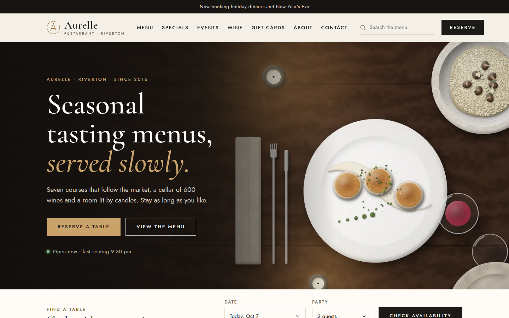
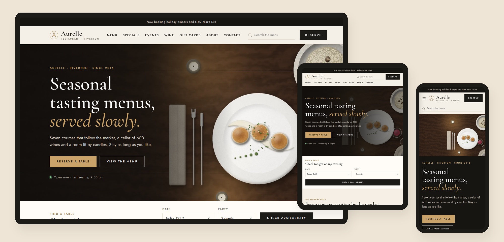

# Aurelle — SkyNet Fine Dining Template

A responsive fine dining restaurant website template for **ASP.NET Core (.NET 10)**, built on the **SkyNet Framework**.
Free and open source. **100% AI-driven coding — built by Claude.**

[](https://dotnet.microsoft.com/)
[](https://www.nuget.org/packages/TheSkyLite.SkyNet)
[](LICENSE)
[](#100-ai-driven-coding)

**Live demo:** https://www.theskylite.com/FineDining



> **Fictional restaurant.** Aurelle, its team, menus, prices, events and wines are invented for demonstration. Reservations, event seats and gift cards are demos — nothing is booked, held or charged.

---

## Features

- **10 pages:** Home, About, Menu, Specials, Events, Event, Reservation, Wine, Gift Cards, Contact
- **Responsive:** desktop, tablet and phone layouts
  - Desktop: inline menu with hover mega menus
  - Tablet: scrolling menu bar, two-column grids
  - Phone: slide-in menu with tap-to-expand sections
- **Reservations:** pick a date, party size and seating (dining room, bar or chef’s counter); the server returns the open times, checks the details and confirms the booking
- **Quick availability:** check any evening from the home page and jump straight to a time
- **Menu:** three tasting menus, an evening cost estimate with pairing, service and tax, and an à la carte menu with course and diet filters (vegetarian, gluten-free, nut-free)
- **Dish details:** tap any dish for a larger picture and the sommelier’s wine suggestions, built on the server
- **Specials:** weekly and seasonal specials; “tonight”, “days left” and “returns in” are worked out from today’s date, plus a seven-day schedule
- **Events:** wine dinners, chef’s tables, holidays and classes with rolling dates, seats left, a booking form and a private dining inquiry with an instant estimate
- **Wine list:** 30 wines with type, region, price and sort filters, sommelier’s picks and a dish-to-wine pairing helper
- **Gift cards:** amounts or tasting experiences, four designs, a message, email or print delivery and a live card preview built on the server
- **Contact:** opening hours with “open now” status, map, FAQ and a message form
- **Site search:** live suggestions across dishes, specials, events and wines
- **Painted artwork:** 51 WebP illustrations — plated dishes, banners and events — painted in code by Claude; no stock photos
- **No front-end build:** plain HTML, CSS and vanilla JavaScript; no npm, no bundler, no SPA framework



---

## Getting started

**Requirements:** .NET 10 SDK and Visual Studio (or any editor with the `dotnet` CLI).

```bash
git clone https://github.com/hkim6000/SkyNet-FineDiningWebsite-Asp.net.Core-Full-Source.git
cd SkyNet-FineDiningWebsite-Asp.net.Core-Full-Source
dotnet run
```

Or open `FineDining.csproj` in Visual Studio and press **F5**.
The SkyNet package (`TheSkyLite.SkyNet`) restores automatically from NuGet.
The app opens on **Home** — the startup page set in `appConfig/application.cfg`.

---

## Project structure

```
FineDining/
├── appConfig/application.cfg      app settings and folder names (startup page = Home)
├── codes/                         page classes (C#)
│   ├── Models/FineDiningModel.cs  data DTOs
│   ├── Home.cs  Menu.cs  Reservation.cs  Wine.cs  ...
├── htmls/                         page markup
├── scripts/                       page JavaScript
├── styles/                        page CSS
├── data/site.json                 dishes, tastings, specials, events, hours, wines, gift cards
├── images/
│   ├── dishes/                    plated dishes (WebP)
│   ├── banners/                   page banners (WebP)
│   ├── events/                    event pictures (WebP)
│   ├── hero.webp
│   └── logo.svg
├── Properties/launchSettings.json   hot reload off
└── Program.cs
```

### One page = four files, one name

| File | Holds |
|---|---|
| `codes/Reservation.cs` | the page class (`: WebPage`) and its server methods |
| `htmls/Reservation.html` | markup with `{plhd_*}` placeholders |
| `scripts/Reservation.js` | one IIFE namespace, `ReservationJs` |
| `styles/Reservation.css` | styles, every class prefixed (`rv-`) |

Each page is self-contained: its own CSS prefix, its own script and its own C# methods.

---

## SkyNet in action

The browser calls a C# method; the method returns an `ApiResponse`; only those parts of the page change.
One request can return one or more instructions, applied at the same time.

```js
// scripts/Reservation.js
$ApiRequest('Reservation/Find', JSON.stringify([
    { key: 'date', vlu: '2026-10-09' },
    { key: 'party', vlu: '4' },
    { key: 'area', vlu: 'dining' }
]));
```

```csharp
// codes/Reservation.cs
public async Task<ApiResponse> Find()
{
    ApiResponse response = new ApiResponse();
    SiteData site = await LoadSite();
    ...
    List<Slot> list = Slots(site, date, party, area, DateTime.Now);
    response.SetElementContents("rv-slots", SlotsHtml(site, list, date, party, area, string.Empty, today));
    return response;
}
```

| Page | Request | Response |
|---|---|---|
| every page | `Search`, `Subscribe` | suggestion list + open it; message + clear the field |
| Home | `Check` | open times for the evening, linked to Reservation |
| Menu | `Filter`, `View`, `Estimate` | dishes + count; dish details + open the modal; itemized estimate |
| Specials | `Filter` | specials + count |
| Events | `Filter`, `Inquire` | events + count; field errors or private dining estimate |
| Event | `Seats`, `Book` | price for the party; field errors or confirmation |
| Reservation | `Find`, `Book` | open times; field errors or confirmation |
| Wine | `Filter`, `Pair` | wine list + count; three suggested wines |
| Gift Cards | `Preview`, `Buy` | live card preview; field errors or card number |
| Contact | `Send` | field errors or confirmation + clear form |

Learn more: [SkyNet Developer Guide](https://www.theskylite.com/documents/SkyNet_Developer_Guide.html)

---

## Customize it

- **Content:** edit `data/site.json` — dishes, tasting menus, specials, events, rooms, hours, seating areas, wines and gift card options
- **Restaurant name:** search and replace `Aurelle` in `htmls/` and the page titles in `codes/`
- **Opening hours:** the `hours` list in `data/site.json` drives reservations, “open now” and the weekly schedule
- **Colors and fonts:** change the CSS variables at the top of each page’s stylesheet (`--hm-gold`, `--hm-wine`, `--hm-serif`, …)
- **Real photos:** replace any WebP in `images/` with your own photos and keep the same file names, or update the paths in `data/site.json`

> Availability is simulated so the demo always shows realistic open and booked times. Connect `Slots()` and the booking methods to your own reservation system.

---

## 100% AI-driven coding

Every file in this template — C#, HTML, CSS, JavaScript, the painted artwork and the data — was generated by Claude (Anthropic's AI) from a short instruction, directed and reviewed by the author.
No line was written by hand.

| | |
|---|---|
| Pages | 10 |
| Lines of code | ~17,000 (C#, HTML, CSS, JavaScript) |
| Images | 51 painted WebP + SVG logo |
| Dishes / tasting menus / events / wines | 30 / 3 / 6 / 30 |
| Lines written by hand | 0 |

SkyNet's simple, predictable page model (one class, four files, `$ApiRequest` → `ApiResponse`) is what makes this possible:
the rules are few and consistent, so AI can generate complete, working pages with very few errors.

---

## License

- **This template** (all source files, artwork and data in this repository): [MIT License](LICENSE) — free to use, modify and redistribute, including commercially.
- **SkyNet Framework** (`TheSkyLite.SkyNet` NuGet package): proprietary, free to use including commercial use; see the license included in the package.

---

## Links

- Live demo: https://www.theskylite.com/FineDining
- SkyNet Framework: https://www.theskylite.com
- NuGet package: https://www.nuget.org/packages/TheSkyLite.SkyNet
- Template #1 — Beauty store: https://github.com/hkim6000/SkyNet-BeautyWebsite-Asp.net.Core-Full-Source
- Template #2 — Pharma company: https://github.com/hkim6000/SkyNet-PharmaWebsite-Asp.net.Core-Full-Source
- Template #3 — Travel blog: https://github.com/hkim6000/SkyNet-TravelWebsite-Asp.net.Core-Full-Source
- Template #4 — Fast food restaurant: https://github.com/hkim6000/SkyNet-FastFoodWebsite-Asp.net.Core-Full-Source
- SkyNet project template: https://github.com/hkim6000/ASPNETCoreEmpty.SkyNet

© 2026 HC Kim
